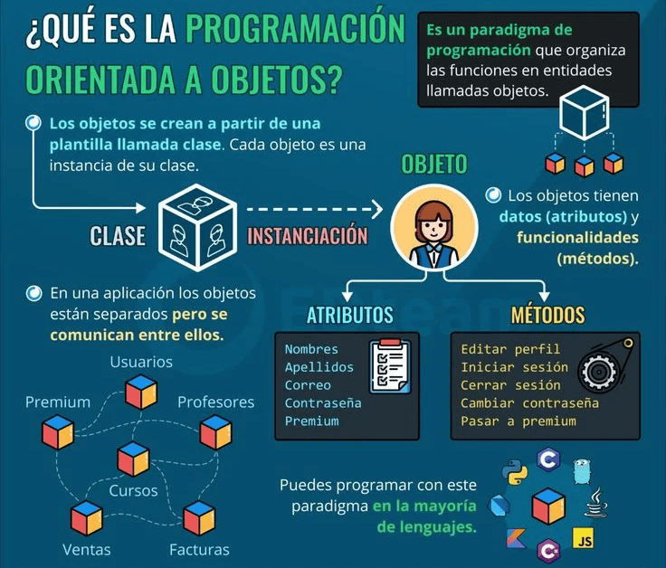
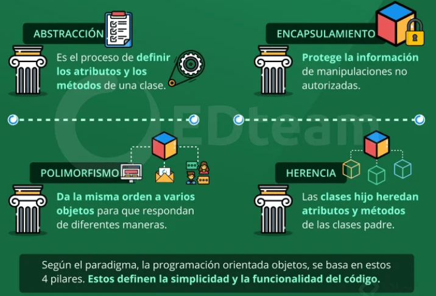
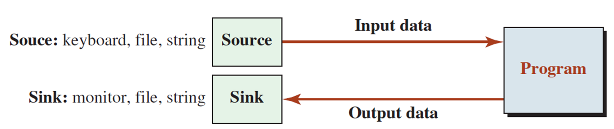
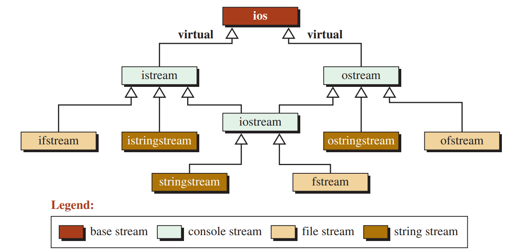

# 1. Relación entre struct y class
En C++, tanto las estructuras (struct) como las clases (class) se utilizan para definir tipos de datos personalizados que pueden contener variables (miembros de datos) y funciones (métodos). struct y class son funcionalmente equivalentes y se pueden utilizar indistintamente, salvo su visibilidad predeterminada:

* struct: Por defecto, todos los miembros son públicos.

* class: Por defecto, todos los miembros son privados.

Ejemplo: Dado la siguiente estructura

```cpp
    #include <iostream>
    #include <cstring>
    using namespace std;

    struct accesoString{ 
        void construirstr(const char *s); //método para construir la cadena
        void mostrarstr(); //método para mostrar la cadena

      private: 
        char str[100];    //para almacenar la cadena
    };

    void accesoString::construirstr(const char * s){
        if(!*s){ // verificamos si la cadena está vacia (s[0] != '\0')
            *str = '\0'; //inicilizamos como una cadena vacía 
        }else{
            strcat(str,s); //concatena al final de str
        } 
    }

    void accesoString::mostrarstr(){
        cout << str << "\n";
    }

    int main(){
        accesoString s; //crea una instancia de accesoString
        s.construirstr(""); //inicializa la cadena como vacía
        s.construirstr("Hello "); // agrega "Hello " a la cadena
        s.construirstr("World!"); //agrega "Wold!" a la cadena

        s.mostrarstr(); //muestra la cedena resultante

        return 0;
    }
```

**Ejercicio 1**. Escribir la versión utilizando clases
```cpp
// 
```

## Programación Orientada a Objetos



## Los 4 Pilares de la Programación Orientada a Objetos




# 2.  Programa, datos y memoria
* Cuando ejecutamos un programa, los datos deben almacenarse en la memoria para el procesamiento, estos datos provienen de una fuente externa y va a un destino  externo.



*  Hasta el momento hemos usado el teclado como fuente y la pantalla como destino. Estos dispositivos son temporales, pues cuando volvemos a ejecutar el programa debemos volver a ingresar los datos y la salida se volverá a generar. El almacenamiento de datos en la memoria es temporal.

* Por otro lado, los archivos se utilizan para la retención (permanente) de datos, que luego  se pueden transferir físicamente a otra computadora y se pueden utilizar una y otra vez.


# 3. Clases para flujos (stream Classes)
Para manejar operaciones de entrada/salida (I/O), la biblioteca C++ define una jerarquía de clases.



## Archivos de Cabecera en C++ para operaciones I/O

* ``<iostream>`` (**input-output stream**) Contiene la definición de objetos como  ``cin``, ``cout``, ``cerr``, etc
(métodos básicos para leer input  e imprimir output)
    1. ``cout`` es la instancia de la clase **ostream**. Insertamos la data en
el flujo estándar de salida -standard output stream- usando el operador de inserción <<

    2. ``cin`` es la instancia de la clase **istream** y es usado para leer input de un dispositivo estándar de entrada. El operador de extracción >> se utiliza para insertar la data en el flujo estandar de entrada.

    3. ``cerr``, es el flujo de error  estándar, utilizado para salida de errores inmediatos, pues no tiene buffer (para almacenar el mensaje de error y mostrarlo despues). Es una instancia de la clase **iostream**.
    
    4. ``clog``, flujo de error estándar. Es una  instancia de la clase **iostream**, es usado para mostrar errores pero a diferencia de cerr el error es primero insertado en un buffer, el mensaje de error también ese muestra en la pantalla


* ``<iomanip>`` (**input output manipulators**), los métodos declarados
en estos archivos son usados para manipular flujos.  Este archivo contiene definiciones de setw, setprecision, etc

* ``<fstream>`` (**file stream**) describe flujo de archivos. Permite leer datos de un archivo como input y escribir datos en un archivo como salida.

# 4. Manejo de archivos en C++
El manejo de archivos en C++ se realiza mediante el uso de flujos (streams) que son clases. Las principales clases de flujo utilizadas para el manejo de archivos son:

* ifstream (input file stream): Para leer de archivos.

* ofstream (output file stream): Para escribir en archivos.

* fstream (file stream): Para leer y escribir en archivos.

Estas clases de flujo son parte de la biblioteca estándar de C++  y proporcionan métodos para abrir, cerrar, leer y escribir en archivos. Para poder utilizarlo debemos agregar ```#include<fstream>``` en el encabezado.

## Apertura y cierre de archivo

* ``void open(const char *NombreArchivo, modo)``

* Modos de apertura

    - ``ios::out`` Solo para  lectura

    - ``ios::in`` Solo para escritura

    - ``ios::in | ios::out`` Para lectura y escritura

    - ``ios::app`` Para añadir contenido a un archivo

    - Tipo de archivo: Por default es TEXTO, para usar binario se debe agregar el modo ``ios::binary``

    - Si no se puede abrir el archivo el stream será nulo

* ``void close();``

    - ``fich.close();``

* ``int eof() const;``

    - Retorna 0 si está en el EOF

* ``void clear(int nState = 0);``

    - Limpia todoslos flags de error dentro del stream;


```cpp
#include <iostream>
#include <fstream>
using namespace std;

int main(){
    char cadena[128];
    ofstream salida("salida.txt");

    salida << "Hola Mundo!" << endl;>
    salida.close(); //

    ifstream entrada("salida.txt");
    entrada >> cadena
    cout << cadena <<endl;

    return 0;
}
//SALIDA Hola ?
```

## Archivos binarios
Los problemas en el búfer se puede solucionar abriendo los archivos en modo binario

* Apertura:

    - ``ofstream fsalida("prueba.dat"`, ios::out | ios::binary);``

    - ``ifstream fentrada ("prueba.dat", ios:: in | ios::binary);``

* Lectura:

    - ``istream& get(char& rch);``

        * rch: es un puntero a caracter. Allí estará el caracer leído

    - ``istream& read(unsigned char*  puch, int n Count);``

        * Puch: Puntero a una estructura de datos

        * nCount: Máxima cantidad de caracteres que se leerán

* Escritura

    - ``ostream& put(cahr ch);``

        * ch: el caracter a insertar

    - ``ostream& write(const unsigned char* puch, int n Count);``

        * puch: Puntero a una estructura de datos

        * nCount: Máxima cantidad de caracteres que se escribirán

```cpp
#include <iostream>
#include <fstream>
#include <cstring>

using namespace std;

struct Registro{
    char nombre[32];
    int edad;
    float altura;
};

int main(){
    Registro pepe, pepe2;

    ofstream fsalida("prueba.dat", ios::out | ios::binary);

    strcpy(pepe.nombre, "Juan Garcia");
    pepe.edad = 42;
    pepe.altura = 1.78;

    fsalida.write((char*)& pepe, sizeof(Registro));

    fsalida.close();

    ifstream fentrada("prueba.dat", ios::in | ios::binary);

    fentrada.read((cahr*)&pepe2, sizeof(Registro));

    cout << pepe2.nombre << endl;
    cout <<pepe2.edad <<endl;
    cout << pepe2.altura <<endl;

    fentrada.close();
    return 0;
}

```


## Acceso Aleatorio

A diferencia de los archivos secuenciales, cuya lectura/escritura va  del inicio al final del archivo; el acceso aleatorio permite leer/escribir en cualquier posición. 

* ``streampos tellp();`` informa la posición dentro de un archivo de salida

* ``streampos tellg();`` informa la posición dentro de un archivo de entrada

* ``ostream& seekp(streamoff offsett, ios::seek_dir dir);`` Cambia la posición del stream de salida

    - ``streamoff`` es un typedef equivalente a long

    - ``offsett`` es la nueva posición de desplazamiento

    - ``dir`` es la dirección de la posición

        * ``ios::beg`` desde el inicio del stream

        * ``ios::cur`` desde la posición actual del stream

        * ``ios::end`` desde el final del stream

* ``istream& seekg(streamoff off, ios::seek_dir dir);`` Cambia la posición del stream de entrada

```cpp
#include <iostream>
#include <fstream>
using namespace std;

int main(){
    int i;
    char cad[20];
    streampos pos; // guardará la posición del archivo

    char mes[][20] = {"Enero", "Febrero", "Marzo", "Abril", "Mayo", "Junio", "Julio", "Agosto", "Setiembre", "Octubre", "Noviembre", "Diciembre"};

    cout << "Crear archivo d enombres de meses: " <<endl;

    ofstream fsalida("meses.dat, ios::out | ios::binary"); //fichero con los meses

    for(i = 0; i < 12; ++i)
        fsalida.write(mes[i],20);

    fsalida.close();

    cou << "\nAcceso secuencial:" <<endl;

    ifstream fentrada("meses.dat", ios::in | ios :: binary);

    fentrada.read(cad,20);

    do{
        cout << cad <<endl;
        fentrada.read(cad,20);

    }while(!fentrada.eof());

    fentrada.clear(); //limpia flags de errrores

    cout <<"\nAcceso aleatorio:" << endl;

    for(i = 11; i >= 0; --i){
        fentrada.seekg(20*i, ios::beg);
        fentrada.read(cad,20)

        cout << cad <<endl;
    }

    //Calcular el numero de elementos almacenados en un fichero
    //El numero de registros es el tamaño en bytes dividido entre el 
    //tamaño del registrto

    fentrada.seekg(0, ios::end); // ir al final del fichero
    pos = fentrada.tellg(); // leer la posicion actual

    cout<< "\nNumero de registros: " << pos/20 << endl;

    fentrada,close();

    return 0;
}
```


```cpp
//flujo hacia la impresora

#include <iostream>
#include <stdafx.h>
#include <fstream>

using namespace std;

int main(int argc, char* argv[]){
    ifstream ArchIN("Readme.txt");
    ofstream Printer("LPT1");
    char cad[80];

    cout << "\nComienza Impresion a PRINTER:" <<endl;

    ArchIN.read(cad,80);

    do{
        Printer.write(cad,80);
        ArchIN.read(cad,80);

    } while(!ArchIn.eof());

    ArchIN.clear(); // limpia los flags de errores

    return 0;

}
```

