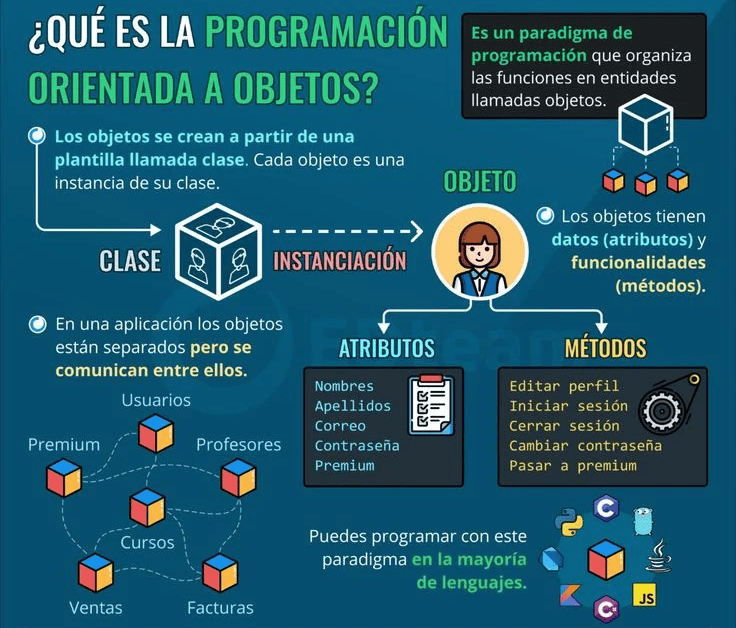
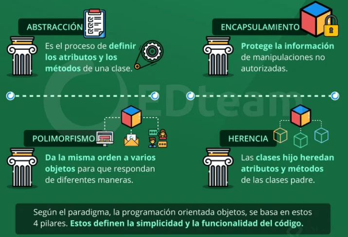
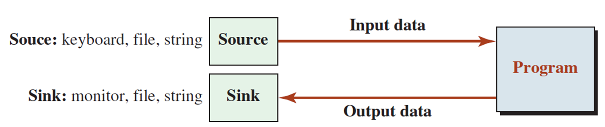
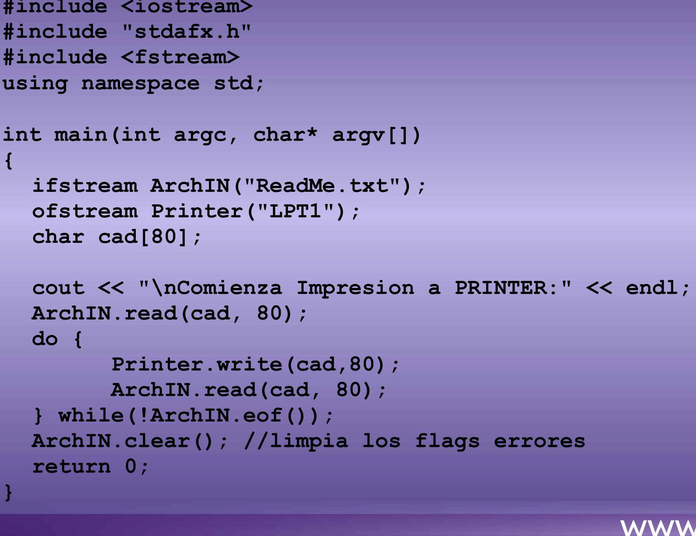

# 1. Relación entre struct y class
En C++, tanto las estructuras (struct) como las clases (class) se utilizan para definir tipos de datos personalizados que pueden contener variables (miembros de datos) y funciones (métodos). struct y class son funcionalmente equivalentes y se pueden utilizar indistintamente, salvo su visibilidad predeterminada:

* struct: Por defecto, todos los miembros son públicos.

* class: Por defecto, todos los miembros son privados.

Ejemplo: Dado la siguiente estructura

```cpp
    #include <iostream>
    #include <cstring>
    using namespace std;

    struct accesoString{ 
        void construirstr(const char *s); //método para construir la cadena
        void mostrarstr(); //método para mostrar la cadena

      private: 
        char str[100];    //para almacenar la cadena
    };

    void accesoString::construirstr(const char * s){
        if(!*s){ // verificamos si la cadena está vacia (s[0] != '\0')
            *str = '\0'; //inicilizamos como una cadena vacía 
        }else{
            strcat(str,s); //concatena al final de str
        } 
    }

    void accesoString::mostrarstr(){
        cout << str << "\n";
    }

    int main(){
        accesoString s; //crea una instancia de accesoString
        s.construirstr(""); //inicializa la cadena como vacía
        s.construirstr("Hello "); // agrega "Hello " a la cadena
        s.construirstr("World!"); //agrega "Wold!" a la cadena

        s.mostrarstr(); //muestra la cedena resultante

        return 0;
    }
```

**Ejercicio 1**. Escribir la versión utilizando clases
```cpp
// 
```

## Programación Orientada a Objetos



## Los 4 Pilares de la Programación Orientada a Objetos




# 2.  Programa, datos y memoria
* Cuando ejecutamos un programa, los datos deben almacenarse en la memoria para el procesamiento, estos datos provienen de una fuente externa y va a un destino  externo.



*  Hasta el momento hemos usado el teclado como fuente y la pantalla como destino. Estos dispositivos son temporales, pues cuando volvemos a ejecutar el programa debemos volver a ingresar los datos y la salida se volverá a generar. El almacenamiento de datos en la memoria es temporal.

* Por otro lado, los archivos se utilizan para la retención (permanente) de datos, que luego  se pueden transferir físicamente a otra computadora y se pueden utilizar una y otra vez.


# 3. Clases para flujos (stream Classes)
Para manejar operaciones de entrada/salida (I/O), la biblioteca C++ define una jerarquía de clases.



## Archivos de Cabecera en C++ para operaciones I/O

* ``<iostream>`` (**input-output stream**) Contiene la definición de objetos como  ``cin``, ``cout``, ``cerr``, etc
(métodos básicos para leer input  e imprimir output)
    1. ``cout`` es la instancia de la clase **ostream**. Insertamos la data en
el flujo estándar de salida -standard output stream- usando el operador de inserción <<

    2. ``cin`` es la instancia de la clase **istream** y es usado para leer input de un dispositivo estándar de entrada. El operador de extracción >> se utiliza para insertar la data en el flujo estandar de entrada.

    3. ``cerr``, es el flujo de error  estándar, utilizado para salida de errores inmediatos, pues no tiene buffer (para almacenar el mensaje de error y mostrarlo despues). Es una instancia de la clase **iostream**.
    
    4. ``clog``, flujo de error estándar. Es una  instancia de la clase **iostream**, es usado para mostrar errores pero a diferencia de cerr el error es primero insertado en un buffer, el mensaje de error también ese muestra en la pantalla


* ``<iomanip>`` (**input output manipulators**), los métodos declarados
en estos archivos son usados para manipular flujos.  Este archivo contiene definiciones de setw, setprecision, etc

* ``<fstream>`` (**file stream**) describe flujo de archivos. Permite leer datos de un archivo como input y escribir datos en un archivo como salida.

# 4. Manejo de archivos en C++
El manejo de archivos en C++ se realiza mediante el uso de flujos (streams) que son clases. Las principales clases de flujo utilizadas para el manejo de archivos son:

* ifstream (input file stream): Para leer de archivos.

* ofstream (output file stream): Para escribir en archivos.

* fstream (file stream): Para leer y escribir en archivos.

Estas clases de flujo son parte de la biblioteca estándar de C++  y proporcionan métodos para abrir, cerrar, leer y escribir en archivos. Para poder utilizarlo debemos agregar ```#include<fstream>``` en el encabezado.


